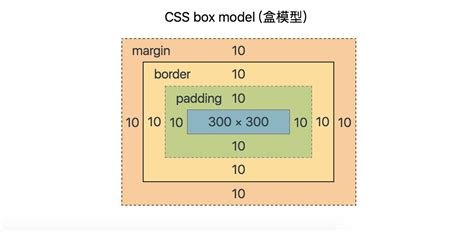
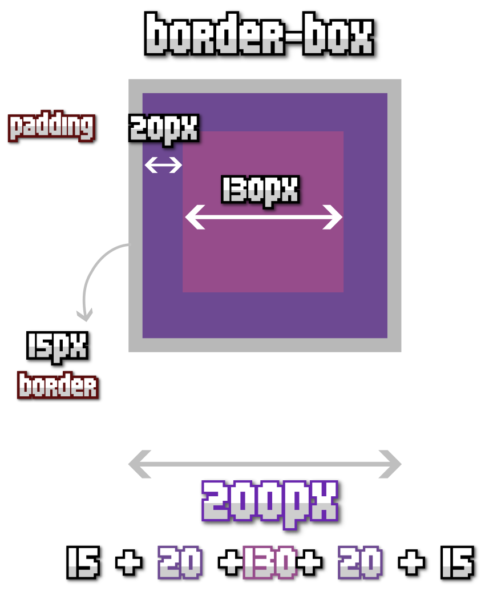

# TODO: Project 2

## Notes

**Preview this file (instead of looking at its code):**

1. In VS Code’s sidebar, right-click (or two-finger click) on README.md and choose “Open Preview”.
2. Right-click on the “Preview README.md” tab above and choose “Split & Move” → “Move Right”.
3. Close the “README.md” tab.

**When helping a friend:**

1. Don’t do the fix for them. (Don’t act like an AI washing your clothes.)
2. **_Let them do the fix_**. Let the person being helped do all the typing and clicking. 
3. Tell them *what* to do. 
4. Also, tell them *why* it was broken or *why* your fix works.

## Project Instructions

**🙋🏻 Don’t forget: you can ask questions at anytime! That’s how you learn. 🧠🧐**

1. Create a new `index.html` file.

2. **Add boilerplate HTML** markup to the file.

   A. You should add the following HTML elements:

      - <!doctype html>
      - html
      - head
      - title
      - body
      - h1
      - footer
     
      > Be sure to use closing tags when needed. Be sure to nest elements correctly. (“nest” means to put one thing inside another.)

   B. Inside the `title` and `h1` elements, use the text: `Project 2`

   C.  Inside the footer, add a `p` element with today’s date.

3. **Add some content** to the page.

   A. Just underneath the `h1`, copy and paste the following HTML:

      ```html
      <p>
        How do we center the content in our browser window? How wide should our content be? How wide should our content be if we look at our webpage on a phone’s browser?
      </p>
      <h2>A poem</h2>
      <p>
        A website is a work of art<br>
        A poem for the digital age<br>
        Built with love and skill<br>
        To inspire while filling the page
      </p>
      ```

      > What new HTML element did we use above? Test it in your web browser. Do you think you know what the “br” stands for? Hint: it’s the first two letters of a word.

   B. 

4. **Add dark mode styles.** Don’t add any light mode styles for now.

   A. Add a `class="dark-mode"` attribute to the `body` element.

   > *Why did we use a `class` instead of an `id` like last time? Is “dark mode” a category (`class`) or a unique name (`id`)? What do you think?*

   B. Create a `styles` folder and then create a `page.css` file inside `styles`.

   C. Add the following CSS:

      ```css
      html {
        box-sizing: border-box;
      }
      body {
        padding: 20px;
      }

      .center {
        width: 842px;
        padding: 20px;
        border: 1px dotted white;
        /* TODO Add CSS to center. */
      }
      .poem {
        text-align: center;
      }
      ```

      > You can copy and paste the CSS above, but look at each line in the `.center` rule and think about what might happen when we add that class to our HTML later.

   C. Add a dark background and light text to our page.css using the **element selector**: `body`

   D. Add a `<link>` on our `index.html` file that will load our `page.css` styles.

   E. Add a `center` **class attribute** to the `footer`.

5. Here’s a diagram showing `margin`, `border`, and `padding` CSS properties.

   

   Here’s a diagram showing what `width` measures when we have this CSS:

   ```css
   .example {
    border: 15px solid grey;
    padding: 20px;
    width: 200px;
   }
   ```

   

## Extra features

1. **Add some fonts!**

   A. Look at the [Google Fonts website](https://fonts.google.com/?lang=en_Latn&preview.text=Hello,%205IN%20students!%20Check%20out%20these%20fonts…).

   - Look at the filters on the left side, especially the “Feeling”, “Appearance”, and “Seasonal” filters.

   - When you find a font, click on it.

   - Then click on the “Get font” button.

   - Then click on the “Get embed code” button.

   B.  Copy the code under “Embed code in the `<head>` of your html” and put it in your `index.html` file.

   C. Under the “CSS class”, copy the `font-family` line and put it in your `page.css`’s `h1` rule.

   D. Find another font and add to your CSS as above. This time add the `font-family` line to your `body` rule.

2. 
